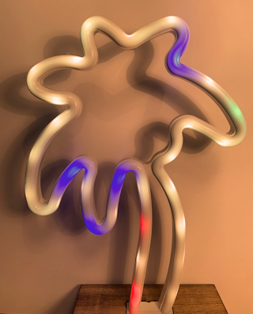

# CORN Clock

I have recently bought a string of WS2812B addressable LEDs and I was looking for something to do with them When I came across this palm shaped "fluorescent" light in a pound shop. I knew I wanted, somehow, to make a timepiece out of it. 

I made a first attempt to color code time with resistors colours that failed mostly due to the poor color gamut of the LEDs, which made it impossible to distinguish some of the colours. This implied I needed to come up with something using less colours. 

The next thing that came to mind was roman numerals and, once I came up with the CORN acronym (**CO**loured **R**oman **N**umerals) I was sold because, we all know it, we need an acronym we think is cool even if it isn't!

I settled on the following coding:

|Colour|Roman|Value|
|------|-----|-----|
|Yellow| L | 50 |
|Red| X | 10 |
|Green| V | 5 |
|Blue| I | 1 |

Contrary to what one might believe the hardest part of the project has been to picture the damn thing in action! The best I could pull off is this lousy picture that doesn't quite make justice to the actual look of the final product.

Reading the above clockwise it shows XXIII IV, so 23:04.

